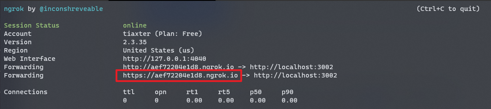

# Stampa Autocertificazioni

## 💡 Proposito

Semplificarmi la vita in tempi di pandemia e fare in modo di poter stampare autocertificazioni al volo, senza stare ad
accendere il computer ogni volta

## 📝 Implementazione:

Ho creato una skill per Alexa che si interfaccia alla prima stampante in rete trovata e manda in coda di stampa
l'autocertificazione.

## 🌱 Requisiti:

* [Docker](https://www.docker.com/)
* [NodeJS](https://nodejs.org/)
* [Ngrok](https://ngrok.com/)
* ASK-CLI installato e configurato
  * Per installare eseguire: `npm i ask-cli -g`
  * Per configurare eseguire `ask configure`

## 🔰 Per inizare

1) Rinominare il file `env.example` in `.env` e modificare le eventuali variabili inserendo le informazioni di rete
   corrette
2) Eseguire il seguente comando in una nuova sessione del terminale:
      ```shell
         ngrok http 3000 # porta presente nel file .env
      ```
3) Copiare il link generato dal comando precedente all'interno del file `skill-package/skill.json`
   
   ```json
    "apis": {
      "custom": {
        "endpoint": {
          "uri": "INSERIRE QUA LINK", // <-- Inserire link qui
          "sslCertificateType": "Wildcard"
        }
      }
    },
   ```
3) Avviare Docker:
    ```shell
      docker-compose up -d --build
    ```
4) Inizializzare il progetto della Skill:
   ```shell
      ask init
   ```
5) Effettuare il deploy della Skill verso l'Alexa Developer Console:
   ```shell
      ask deploy
   ```
6) Ora sei pronto per eseguire la skill! Chiedi al tuo dispositivo:
   ```Alexa, stampa autocertificazione```
